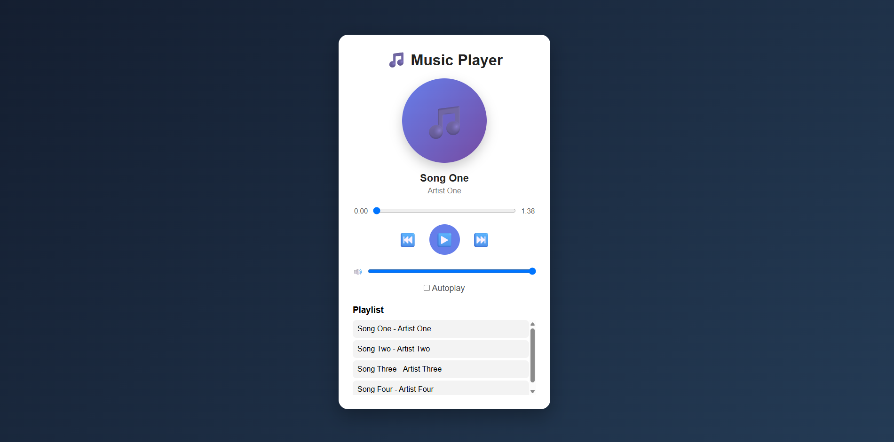

# 🎵 Music Player

A responsive and interactive music player web application built using **HTML, CSS, and JavaScript**.

The project provides a clean interface for playing and controlling audio directly in the browser.

## 📸 Preview

  

## ✨ Features

* ▶️ Play and pause music
* ⏭️ Next and previous track controls
* 🎵 Music track selection
* 🔊 Audio controls
* 📱 Responsive user interface
* 🎨 Clean and modern design
* 🌐 Runs directly in the browser
* 📂 Local music file support

## 🛠️ Technologies Used

* **HTML5** — Page structure and audio elements
* **CSS3** — Styling, layout, and responsive design
* **JavaScript** — Music player functionality and user interactions

## 📁 Project Structure

music-player/
│
├── music/
│   └── Audio files
│
├── index.html
├── style.css
├── script.js
└── README.md

## 🎯 Learning Objectives

This project was created to practice and strengthen my understanding of:

* HTML5 audio elements
* JavaScript DOM manipulation
* JavaScript event handling
* Working with audio controls
* Managing application state
* CSS layouts
* Responsive web design
* Building interactive frontend applications

## 🔮 Future Improvements

Possible future improvements include:

* 🔀 Shuffle mode
* 🔁 Repeat mode
* ❤️ Favorite songs
* 📋 Custom playlists
* 🎚️ Advanced progress controls
* 🔍 Music search
* 🌙 Dark/light theme
* 💾 Playlist persistence using Local Storage

## 👨‍💻 Author

### Md. Moniruzzaman Badhon

Software Engineering Student | Frontend Developer

* GitHub: https://github.com/Moniruzzaman-Badhon
* LinkedIn: https://www.linkedin.com/in/moniruzzaman-badhon-b50153308/

## ⭐ If you like this project

Feel free to ⭐ the repository and explore my other projects.

  Built with ❤️ using HTML, CSS & JavaScript

